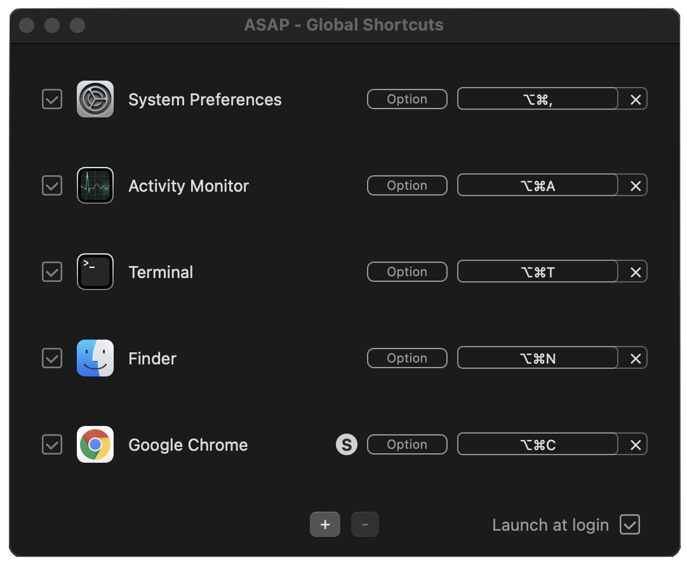

# ASAP Shortcuts

ASAP is the global shortcuts App for macOS, written in Swift and SwiftUI.

Key Features
  - Spawn a New Window of apps on the current Space ASAP.
  - Launch system apps like System Preferences and Finder.

## Demo
New Window on the current space with a single shortcut press.

End of the short journey of the cursor for New Window.

## System Requirements
ASAP supports macOS v10.15+

## Installation
It's available on [App Store](https://apps.apple.com/us/app/asap-shortcuts/id1558863477)

## License

ASAP is licensed under the terms of the [MIT License](LICENSE).
